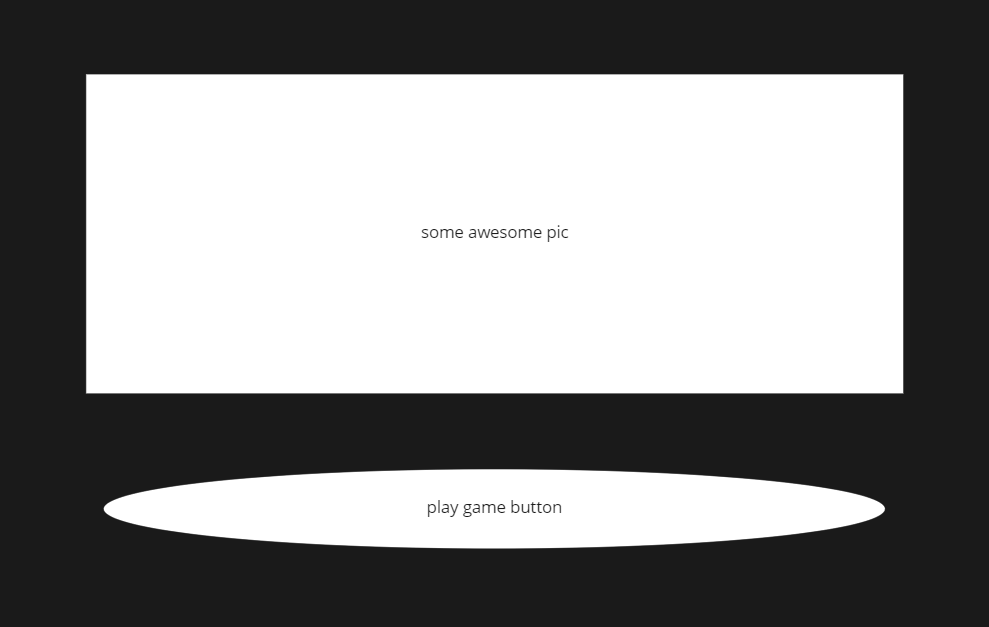
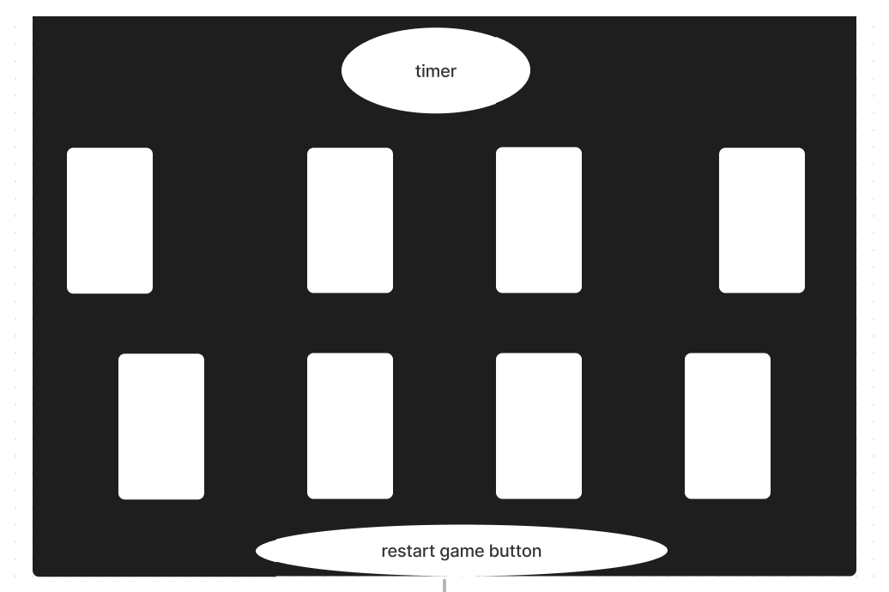

# Concentration game

## WHAT THE GAME WILL BE ABOUT

-A memory game that will require players to match cards of the same picture
-The player will have a limited amount of time to 
match 6 pairs of pictures
-Player will also lose the game if the timer runs out


## HOW TO PLAY

1. Find the 3 pairs of matching pictures before the
timer runs  out
2. click on each image and remember where it is, try to find a match to that picture
3.  This game is all about memory! So try and remember where the images are placed
4. There are 8 cards, meaning there are 4 pairs of
pictures. Find them all before the timer runs out to win the game!

## WIREFRAMES




## MV USER-STORIES

-As a user i want to start the game
 
1. in js:
```
const cards = document.querySelectorAll(".card")

chosenCards = []
wrongCards = []


```
2. in my html:
```
<!DOCTYPE html>
<html lang="en">
<head>
    <meta charset="UTF-8">
    <meta http-equiv="X-UA-Compatible" content="IE=edge">
    <meta name="viewport" content="width=device-width, initial-scale=1.0">
    <title>Memory Game</title>
</head>
<link rel="stylesheet" href="style.css">

<body>
      <main id="starterPage">
  
    <button class="playButton">Play game!</button>
  
                </main> 
                <h1 class="winLoss"></h1>
                <h1 class="msg"></h1>

                
                    <p id="timer">2:00</p>
                      <h1 class="msg"></h1>
                          <section id="memory-game" class="hide">
                              <div class="card" data-id="burger">
                                
                                
                              </div>
                              <div class="card" data-id="burger" >
                                
                                
                              </div>
                              <div class="card" data-id="fries">
                                
                                
                              </div>
                              <div class="card" data-id="fries">
                                
                                
                              </div>
                              <div class="card" data-id="pasta">
                                
                                
                              </div>
                              <div class="card"data-id="pasta" >
                                
                                
                              </div>
                              <div class="card"data-id="pizza" >
                                
                                
                              </div>
                              <div class="card" data-id="pizza">
                                
                                
                              </div>
                          </section>
                            <button id="reset">Reset Game</button>
                           
</body>   
   
                    
                    
<script src="script.js"></script>
</html>


```
> initialize function to call other created objects that start the game 
    
> initialize() is used to start the app in a web server
     
> place new game inside the initialize function to update the DOM with our set classes, functions, etc
> instanitate the class by using the keyword new 
    to create a new object of our class, runs the constructor function in the class, returns the object and updates the DOM with all the 
    properties and methods from the class

       
**-As a user i want to click the play button**

1. in my html:
```
     <button class="playButton">Play game!</button>
```

2. in my js:
```
    const playButton = document.querySelector(".playButton") 

        playButton.addEventLister("click")

```
 > add an eventListener to this button


**-As a user i want to have a starter page**

1. in my HTML:
```
       <main id="starterPage">
  
    <button class="playButton">Play game!</button>
  
                </main> 
```                

**-As a user i want to have a gameboard**

1. in my html:
```
    <body>
      <main id="starterPage">
    <button class="playButton">Play game!</button>
                </main> 

                <h1 class="winLoss"></h1>
                <h1 class="msg"></h1>

                
                    <p id="timer">2:00</p>
                      <h1 class="msg"></h1>
                          <section id="memory-game" class="hide">
                              <div class="card" data-id="burger">
                                
                                
                              </div>
                              <div class="card" data-id="burger" >
                                
                                
                              </div>
                              <div class="card" data-id="fries">
                                
                                
                              </div>
                              <div class="card" data-id="fries">
                                
                                
                              </div>
                              <div class="card" data-id="pasta">
                                
                                
                              </div>
                              <div class="card"data-id="pasta" >
                                
                                
                              </div>
                              <div class="card"data-id="pizza" >
                                
                                
                              </div>
                              <div class="card" data-id="pizza">
                                
                                
                              </div>
                          </section>
                            <button id="reset">Reset Game</button>
                           
</body>   

```
> 


**-As a user i want to be taken to another page where i can see the game-board**

1. in my HTML:
```
    <h1 class="winLoss"></h1>

                
                    <p id="timer">2:00</p>
                      <h1 class="msg"></h1>
                          <section id="memory-game" class="hide">
                              <div class="card" data-id="burger">
                                
                                
                              </div>
                              <div class="card" data-id="burger" >
                                
                                
                              </div>
                              <div class="card" data-id="fries">
                                
                                
                              </div>
                              <div class="card" data-id="fries">
                                
                                
                              </div>
                              <div class="card" data-id="pasta">
                                
                                
                              </div>
                              <div class="card"data-id="pasta" >
                                
                                
                              </div>
                              <div class="card"data-id="pizza" >
                                
                                
                              </div>
                              <div class="card" data-id="pizza">
                                
                                
                              </div>
                          </section>
                            <button id="reset">Reset Game</button>
                           
```
2. in my js:

```
const cards = document.querySelectorAll(".card")
const message = document.querySelector(".msg")
const winLossMsg = document.querySelector(".winLoss")
const playButton = document.querySelector(".playButton") 
const resetButton = document.querySelector("#reset")
const timer = document.querySelector("#timer")

```

3. in my css:

```
*{
  padding: 0;
  margin: 0;
  box-sizing: border-box;
}

body{
  height: 100vh;
  background-color: thistle;
  display: flex;
}


#memory-game{
  margin: auto;
  display: flex;
  flex-wrap: wrap;
  width: 1200px ;
  height: 600px ;
}


.card{
  margin: 5px;
  width: calc(25% - 10px);
  height: calc(50% - 10px);
  position: relative;
  transform: scale(1);
  transform-style: preserve-3d;
  transition: transform .5s;
}

```

**-As a user i want to be able to see my gameboard**

1. in my HTML:

```
       <h1 class="winLoss"></h1>

                
                    <p id="timer">2:00</p>
                      <h1 class="msg"></h1>
                          <section id="memory-game" class="hide">
                              <div class="card" data-id="burger">
                                
                                
                              </div>
                              <div class="card" data-id="burger" >
                                
                                
                              </div>
                              <div class="card" data-id="fries">
                                
                                
                              </div>
                              <div class="card" data-id="fries">
                                
                                
                              </div>
                              <div class="card" data-id="pasta">
                                
                                
                              </div>
                              <div class="card"data-id="pasta" >
                                
                                
                              </div>
                              <div class="card"data-id="pizza" >
                                
                                
                              </div>
                              <div class="card" data-id="pizza">
                                
                                
                              </div>
                          </section>
                            <button id="reset">Reset Game</button>
```                           

2. in my css:
```
*{
  padding: 0;
  margin: 0;
  box-sizing: border-box;
}

body{
  height: 100vh;
  background-color: thistle;
  display: flex;
}


#memory-game{
  margin: auto;
  display: flex;
  flex-wrap: wrap;
  width: 1200px ;
  height: 600px ;
}


.card{
  margin: 5px;
  width: calc(25% - 10px);
  height: calc(50% - 10px);
  position: relative;
  transform: scale(1);
  transform-style: preserve-3d;
  transition: transform .5s;
}

```
3. in my js:

```
playButton.addEventListener("click", switchPage)


function switchPage (){
    const cardsHidden = document.querySelector(".hide")
    const gameButton =  document.querySelector(".playButton")
    if  (cardsHidden.style.display = "block"){
       gameButton.style.display = "block"
    }
    }


```


**-As a user i want to reset the game**


1. in my html:
 `const resetButton = document.querySelector("#reset")`
2. in my js:

```
    const resetButton = document.querySelector("#reset")

    function resetGame() {
    firstCard.classList.remove("flip")
    secondCard.classList.remove("flip")

    }

    resetButton.addEventListener("click", resetGame)
```

    

**-As a user i want to have a message that tells me i won/lost**


1. in my html: 
```
    <h1 class="msg"></h1

```
2. in my js
```
    if (chosenCards.length === 8 ){
       document.querySelector(".winLoss").innerHTML = ("you got it!") 
      


    }else if (wrongCards.length === 4){
       document.querySelector(".msg").innerHTML = "" 
       document.querySelector(".winLoss").innerHTML = ("you lose") 
       
    }
```


**-As a user i want to see my timer**

1. in my html:
```
<p id="timer">2:00</p>

```


**-As a user i want to know if i won**
1. in my html:
```
    <h1 class="winLoss"></h1>

```

2. in my js:
```
   if (chosenCards.length === 8 ){
       document.querySelector(".winLoss").innerHTML = ("you got it!") 
```
**-As a user i want to know if i lost**
1. in my html:
```
    <h1 class="winLoss"></h1>

```

2. in my js:
```
  const winLossMsg = document.querySelector(".winLoss")

  if (wrongCards.length === 4){
       document.querySelector(".msg").innerHTML = "" 
       document.querySelector(".winLoss").innerHTML = ("you lose") 
       
    }

```
**-As a user i want to know when the time is out**
1. in my html:
`<p id="timesUp"></p>`

2. in my js:

    `const timesUp = doument.querySelector("#timesUp")`
    `if (minutes === 0 && seconds === 0){`
        `document.querySelector("#timesUp").innerText = "TIMES UP!",`
   ` }else{`
        `document.querySelector ("#countdown").innerHTML = minutes + " : " + seconds`
    `}`

> updating the dom to show a message once the timer has run out("00:00)

**-As a user i want to know if i got a match wrong**

1. in my html:
2. in my css:
3. in my js:
```
    function cardsDontMatch () {
    setTimeout(() => {
    firstCard.classList.remove("flip")
    secondCard.classList.remove("flip")
    message.innerHTML = ""
    }, 500)
}

```


**-As a user i want to know when the game is over**
1. in my js:

`gameOver(){`
    `if (document.querySelelctor(#timesUp) == "TIMES UP!") !winningCombos}{`    
        `alert("GAME OVERRRR!")`
    `}else if(document.querySelector(#timesUp) === "TIMES UP!"`
        `if (winningCombos === [0]){`
           `alert("GAME OVERRR!") `
           `}else if (winningCombos === [1]){`
           `alert("GAME OVERRR!")`
           `}else if (winningCombos === [2]){`
           `alert("GAME OVERRR!")`
           `}else if (winningCombos === [3]){`
           `alert("GAME OVERRR!")`
>create a gameOver method that will update the DOM to show that the player has lost based on running out of time, getting no matching pairs
>or running out of time and getting only 1-3 of the matching pairs
## TIER2 USER STORIES
-As a user I want to play against another player
-As a user I want to have music
-As a user I want to multiple players
-As a user i want to able to increase points
## TIER3 USER STORIES
-As a user I want to join an online game