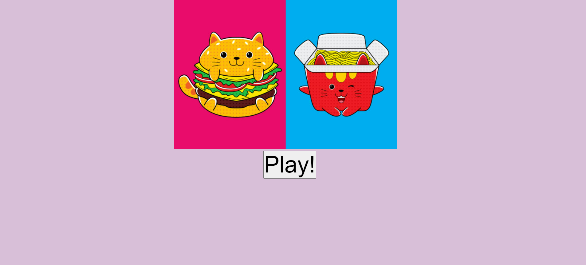
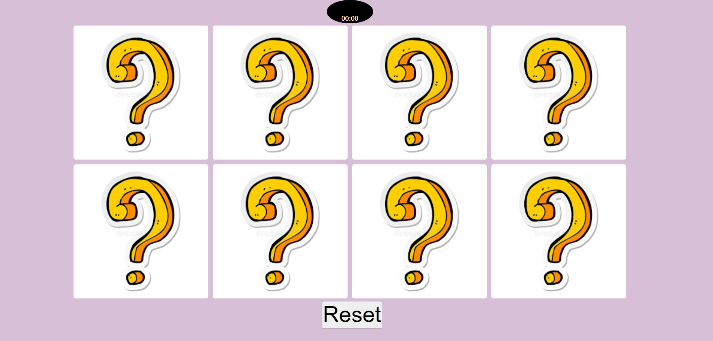

# Memory Game
**DESCRIPTION**
>Find all the matches with less than 2 mistakes and you win the game!

## GETTING STARTED/ HOW TO PLAY

1. Find the 4 pairs of matching pictures 
2. click on each image and remember where it is, try to find a match to that picture by clicking on another card
3. This game is all about memory! So try and remember where the images are placed
4. There are 8 cards, meaning there are 4 pairs of
pictures. Find them all with less than 2 wrong guesses and you win the game!

  **LAUNCH GAME HERE**
  [MemoryGame](https://godise.github.io/Project-1-game/)

## TECHNOLOGIES USED
1. Html
2. Css
3. Javascript

## WIREFRAMES

## TIER1 USER-STORIES

1. **-As a user i want to play the game**     
2. **-As a user i want to click the play button**
3. **-As a user i want to be able to see my gameboard**
4. **-As a user i want to reset the game**   
5. **-As a user i want to have a message that tells me i won/lost**
6. **-As a user i want to see my timer**
7. **-As a user i want to know if i won**
8. **-As a user i want to know if i lost**
9. **-As a user i want to see timer count up**
10. **-As a user i want to know when the game is over**

## TIER2 USER STORIES

1. **-As a user I want to play against another player**
2. **-As a user I want to have music**
3. **-As a user I want to multiple players**
4. **-As a user i want to increase points**

## TIER3 USER STORIES

1. **-As a user I want to join an online game**

