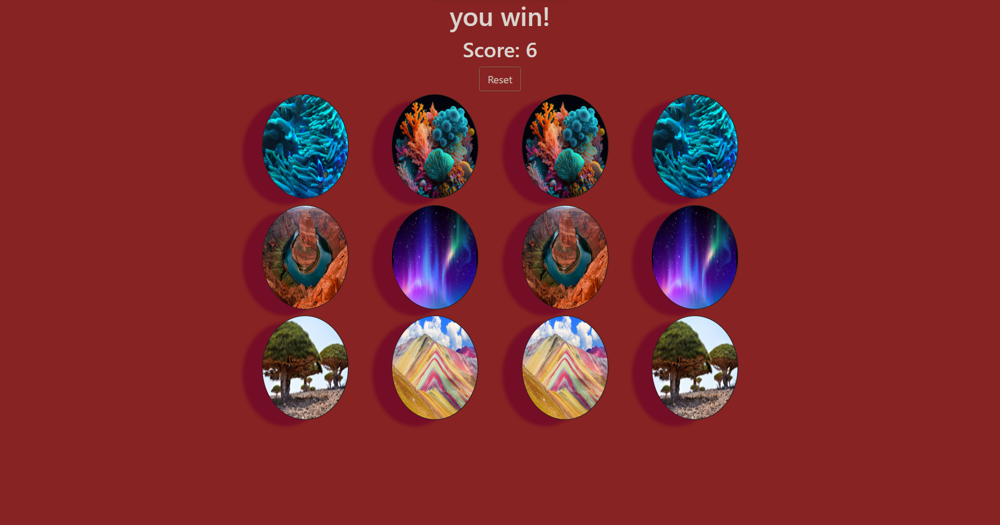
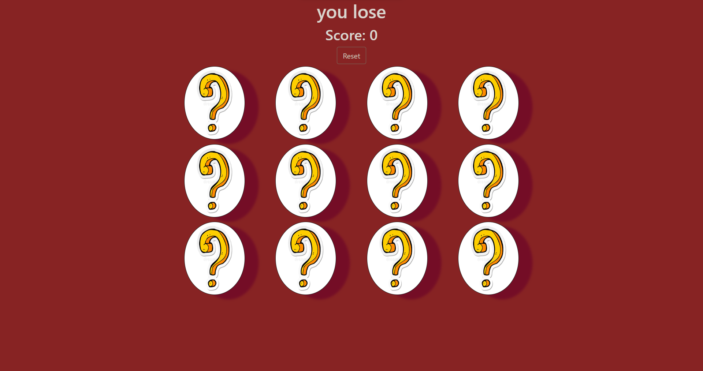

# Memory Game
**DESCRIPTION**
>Find all the matches with less than 4 mistakes and you win the game!

## GETTING STARTED/ HOW TO PLAY

1. Find the 12 pairs of matching pictures 
2. click on each image and remember where it is, try to find a match to that picture by clicking on another card
3. This game is all about memory! So try and remember where the images are placed
4. There are 16 cards, meaning there are 8 pairs of
pictures. Find them all with less than 4 wrong guesses and you win the game!

  **LAUNCH GAME HERE**
  [MemoryGame](https://godise.github.io/Project-1-game/)

## TECHNOLOGIES USED
1. HTML
2. CSS
3. JavaScript
4. Bootstrap

## WIREFRAMES

## TIER1 USER-STORIES

1. **-As a user I want to play the game**     
2. **-As a user I want to click the play button**
3. **-As a user I want to be able to see my gameboard**
4. **-As a user I want to reset the game**   
5. **-As a user I want to have a message that tells me I won/lost**
6. **-As a user I want to see my score**
7. **-As a user I want to know if I won**
8. **-As a user I want to know if I lost**
9. **-As a user I want to see my score increase or decrease depending on correct/incorrect matches**
10. **-As a user I want to know when the game is over**

## TIER2 USER STORIES

1. **-As a user I want to play against another player**
2. **-As a user I want to have music**
3. **-As a user I want to multiple players**
4. **-As a user I want to increase points**

## TIER3 USER STORIES

1. **-As a user I want to join an online game**

